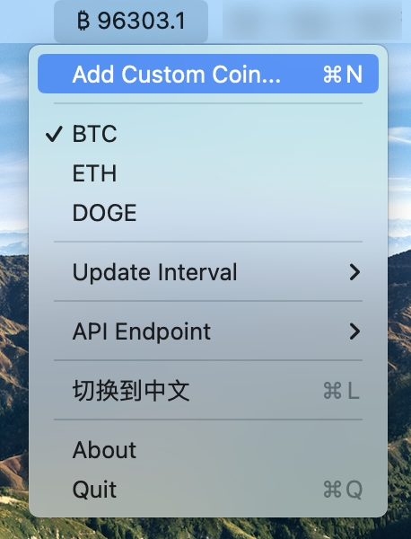

# BTC Watcher

[English](README.md)

一个轻量级的 macOS 菜单栏应用，用于实时追踪加密货币价格。



## 功能特点

- 轻量级菜单栏应用
- 支持多种加密货币（BTC、ETH、DOGE）
- 支持添加自定义交易对
- 实时价格更新（1秒、2秒、5秒可选）
- 自动切换 API 接口
- 支持中英文界面
- 零依赖，纯 Swift 实现

## 系统要求

- macOS 13.0 或更高版本
- 需要网络连接以获取价格更新

## 安装方法

1. 下载最新版本的 `BTCWatcher.app`
2. 将应用拖入应用程序文件夹
3. 双击启动应用
4. 如果出现安全提示，请在系统设置 > 安全性与隐私中允许应用运行

## 使用说明

### 基本操作
- 点击菜单栏图标查看当前价格
- 从菜单中选择不同的加密货币
- 使用 `⌘Q` 退出应用

### 自定义设置
- 更新频率：可选 1秒、2秒或 5秒
- API 接口：自动或手动选择
- 语言：切换中英文界面
- 自定义：添加自定义交易对

### 快捷键
- `⌘N`：添加自定义币种
- `1`：设置 1 秒更新频率
- `2`：设置 2 秒更新频率
- `5`：设置 5 秒更新频率
- `A`：切换 API 自动模式
- `L`：切换语言
- `⌘Q`：退出应用

## 开发相关

### 从源码编译
```bash
# 编译应用
swiftc -o BTCWatcher.app/Contents/MacOS/BTCWatcher main.swift

# 生成应用图标
./generate_icons.sh
```

### 项目结构
- `main.swift`：主程序代码
- `AppIcon.svg`：应用图标源文件
- `generate_icons.sh`：图标生成脚本
- `Info.plist`：应用配置文件

## 数据来源

价格数据通过以下 Binance API 接口获取：
- api.binance.com
- api1.binance.com
- api2.binance.com
- api3.binance.com
- api4.binance.com

## 技术细节

### 实现方式
- 使用原生 macOS 框架（Cocoa、Foundation）
- 无外部依赖
- 使用 NSStatusItem 实现菜单栏集成
- 自动错误处理和 API 故障转移
- 动态菜单生成
- 实时价格格式化

### 价格显示
- 智能小数位处理
- 使用 Unicode 符号表示加密货币（₿、Ξ、Ð）
- 简洁清晰的界面

### 错误处理
- 自动切换 API 接口
- 连接错误恢复
- 友好的错误提示
- 优雅的降级处理

## 安全性

- 仅使用公开 API 接口
- 最小系统权限要求
- 不存储敏感数据
- 经过 macOS 安全签名

## 参与贡献

欢迎参与贡献！你可以：
- 报告问题
- 提出新功能建议
- 提交代码
- 改进文档

## 开源协议

MIT 协议

## 作者

chenwuai

## 支持

如有问题或建议：
1. 提交 Issue
2. 提交 Pull Request
3. 联系开发者

---

*注意：本应用与币安或任何加密货币交易所均无关联。*
